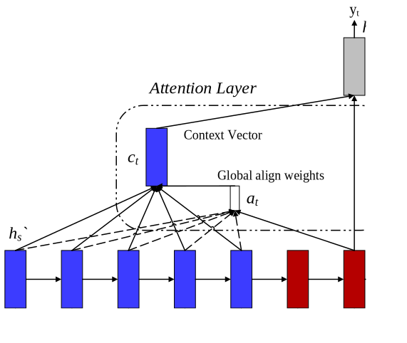
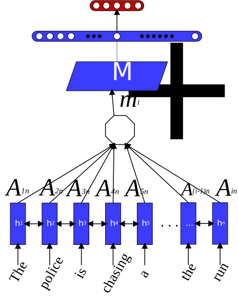
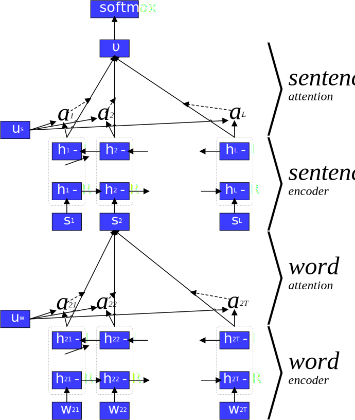
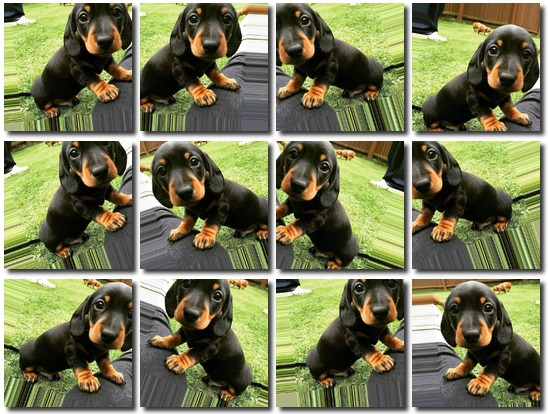
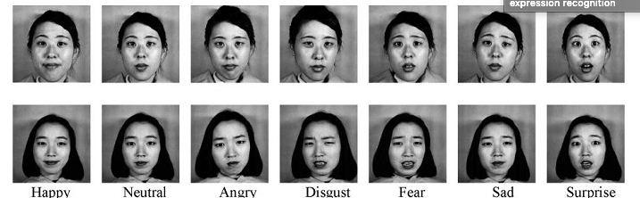
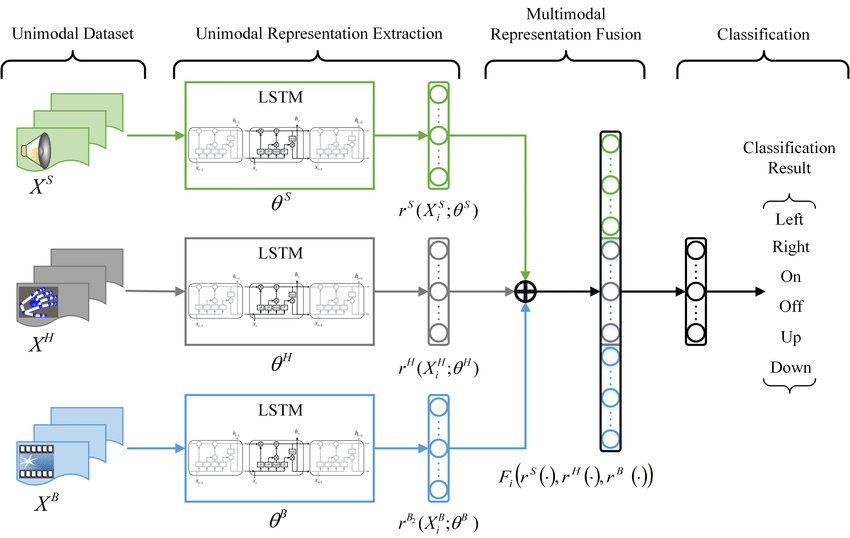

# Multimodal Emotion Recognition using Deep Learning Techniques

Code for the papers:  

[Examining Attention Mechanisms in Deep Learning Models for Sentiment Analysis](https://www.mdpi.com/2076-3417/11/9/3883) (AppSci 2021).

(Under Review)

(Under Review)

(Under Review)

## Getting Started

* [Introduction](#introduction)
* [Features](#features)
* [Dependencies](#dependencies)
* [Running the Model](#running-the-model)
* [Implementation Details](#implementation-details)
  * [Textual Emotion Recognition](#textual-emotion-recognition)
  * [Facial Emotion Recognition](#facial-emotion-recognition)
  * [Multimodal Emotion Recognition](#multimodal-emotion-recognition)
* [Experimental Results](#experimental-results)  
* [Citation](#citation)
* [Credits](#credits)

## Introduction

This work studies the field of Emotion Recognition in-depth. The use of deep learning techniques in the fields of **Textual and Facial Emotion Recognition** skyrocketed the performance of classification methods and are the main direction that is currently pursued by researchers, introducing a variety of challenges. In terms of the methodology proposed in this work, a wide variety of architectures and approaches are implemented, leading to different models for the text and the image aspect of the system.

Then, the field of **Multimodal Emotion Recognition** is presented, including its theory and literature. The main goal is to realize an end-to-end deep learning pipeline, in order to address the problem of understanding human emotions and improve the accuracy over the traditional standalone models. An important aspect of the field that is explored is the fusion of modalities which is often performed through a fusion at the feature and/or decision-level. The task at hand is supervised classification. Two additional topics showcased in this work are attention mechanisms and a systematic review of the available datasets in the Emotion Recognition domain.

In order to explore the performance of the proposed models in recognizing peoples’ emotions we implement them and evaluate them on a variety of real-world datasets. Thus, we come to conclusions regarding their overall emotion recognition accuracy, when compared to each other, as well as when compared to state-of-the-art approaches.

## Features

* State-of-the-art text Deep Learning model implementation
* Wide variety of facial and multimodal Deep Learning model implementations and architectures.
* Extensive parameter and configuration tuning
* Support for Word Embeddings (e.g. Word2Vec)
* Data Visualisation
* Data Augmentation
* Model Evaluation on all major datasets of the field

## Dependencies

**Python** Version:
```
Python >= 3.6
```
General Libraries:
```
numpy
pandas
time
math
matplotlib
```
Required for Deep Learning components and algorithms:
```
tensorflow 1.x (tested on 1.15.0)
keras (tested on 2.3.1)
```
Required for text and image preprocessing as well as performance metrics:
```
scikit-learn
gensim
seaborn
cv2
```

## Running the Model

Each file and folder constitutes a standalone implementation of a method/experiment, and as a result slight adjustments may be needed to run the corresponding model. **In general**:

1. Run the `.ipynb` file accompanied by the required data folders directly on [Google Colab](https://colab.research.google.com/). Ready to go, with support for easy parameter tuning.  
2. Alternatively, load the `.ipynb` file on a local setup featuring Jupyter Notebook and the aforementioned dependencies. Small fixes might be required such as removal of "!" commands, that are intended for use only with Google Colab.
3. If you want to evaluate on a single new instance instead of benchmark dataset, head over to the "Evaluate on External Data" section and set the `test_sentence` string.  

## Implementation Details

### Textual Emotion Recognition

A rather exciting implementation of this work, are Attention-based Neural Networks. The attention mechanism has the ability to attend to the important parts of a sequence and as a result, consistently improve the performance of a Neural Network in a variety of tasks, including Sentiment Classification, Emotion Recognition, Machine Translation and Speech Recognition.

Attention is arguably one of the most powerful recent concepts in Deep Learning, bringing out many breakthroughs in the field and increasing the performance of neural networks ([Vaswani et al.](https://arxiv.org/abs/1706.03762)).

* Global (Soft) Attention ([Bahdanau et al.](https://arxiv.org/abs/1409.0473))



&nbsp;

* Self Attention ([Cheng et al.](https://arxiv.org/abs/1706.03762))



&nbsp;

* Hierarchical Attention ([Yang et al.](https://aclanthology.org/N16-1174/))



### Facial Emotion Recognition

An interesting aspect of the proposed implementations is the use of Data Augmentation. Deep neural networks require sufficient training data to ensure generalizability to a given recognition task. However, most publicly available databases do not have a sufficient quantity of images for training. Therefore, data augmentation is a vital step for deep facial emotion recognition.

Example of executing rotation, shift and scaling on an image for Data Augmentation:



&nbsp;

Samples from one of the benchmark Datasets (JAFFE):



### Multimodal Emotion Recognition

Most of the early works in Emotion Recognition focused on data of a single modality, such as a product review or a facial expression. More recent efforts have focused on multimodal fusion since human emotion is expressed through multiple modalities, specifically text, facial expressions and voice.

An important aspect of this work is the fusion of modalities. Most of the implemented architectures are based on the following illustration:



## Experimental Results

Refer to the Citation Papers of this work.

## Citation

Please cite this work using the first paper below:

```
@article{kardakis2021examining,
  title={Examining Attention Mechanisms in Deep Learning Models for Sentiment Analysis},
  author={Kardakis, Spyridon and Perikos, Isidoros and Grivokostopoulou, Foteini and Hatzilygeroudis, Ioannis},
  journal={Applied Sciences},
  volume={11},
  number={9},
  pages={3883},
  year={2021},
  publisher={Multidisciplinary Digital Publishing Institute}
}

(Under Review)

(Under Review)

(Under Review)
```

## Credits

[Spyridon Kardakis](https://www.linkedin.com/in/kardakis/)